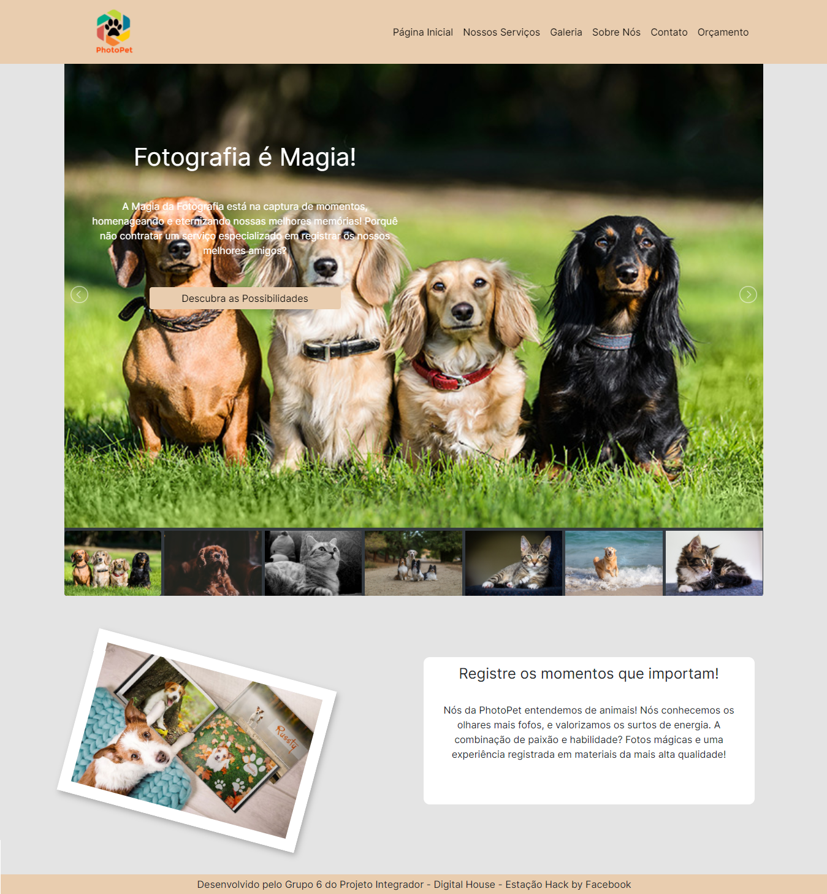
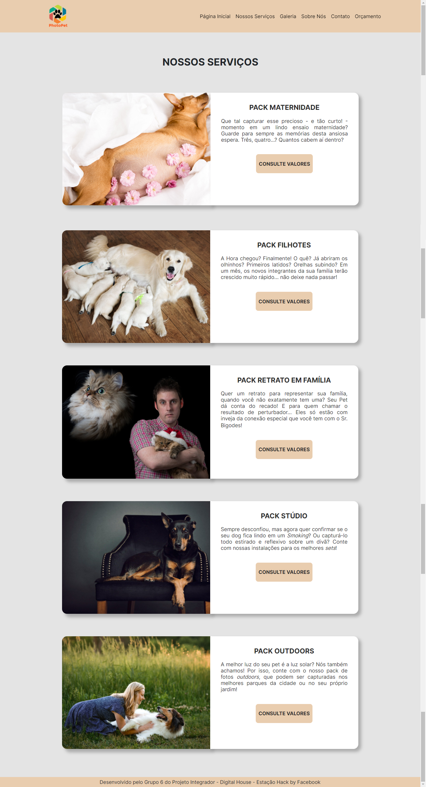
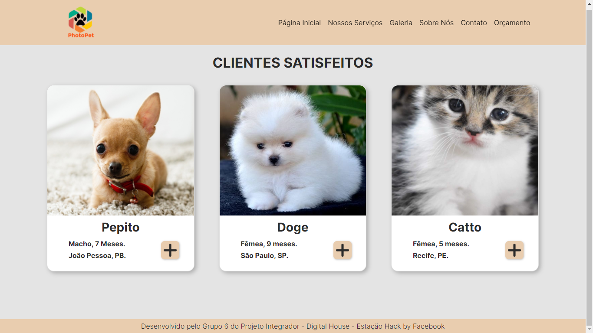
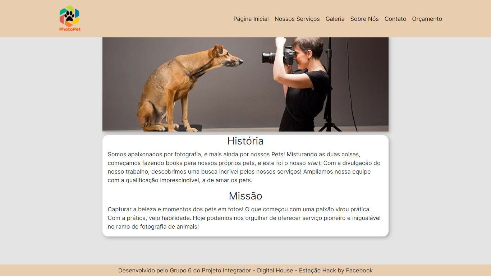
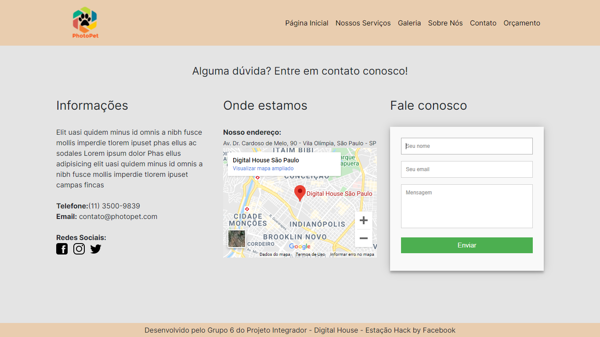
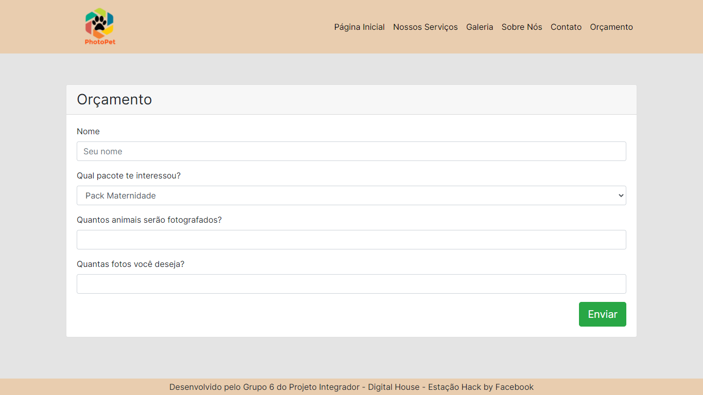

# GPI6_PhotoPet

Front End Coding Facebook

Projeto desenvolvido para curso de Front-End da Digital House - Estação Hack by Facebook.

<h4 align="center"> 
	🚧  PhotoPet 👨‍🏫 Demonstração ✔️ 🚧
</h4>

## :coffee: Facebook - Digital House

O Front End Coding Facebook é um programa educacional promovido pelo Facebook em parceria com a instituição de ensino Digital House. <br>
Para poder ingressar no programa cada aluno, foi submetido um processo seletivo com o intuito de ser um dos 200 bolsistas, que receberiam bolsas integrais de estudo para o curso de Desenvolvimento Web Front End.

<br>

## 💻 Sobre o projeto

Projeto integrador desenvolvido durante o curso de Desenvolvimento Web Front End oferecido pela [digitalhouse](https://www.digitalhouse.com/br/) em parceria com o Facebook.
<br>
:shipit: PhotoPet - Surgiu com a missão de permitir que as pessoas tenham a oportunidade de eternizar bons momentos com seus bichinhos de estimação que, sejamos sinceros, são verdadeiros membros das famílias modernas. :dog: :cat: :rabbit:

## 🖼 Screenshot das telas do site 
<br>
<br>

## 🖼 Tela principal da plataforma do PhotoPet 
<br>
 
<br>

## 🖼 Tela Serviços Disponíveis

<br>
 
<br>

## 🖼 Tela Galeria de Clientes

<br>
 
<br>

## 🖼 Tela Sobre Nós

<br>
 
<br>

## 🖼 Tela Contato

<br>
 
<br>

## 🖼 Tela Orçamento

<br>
 
<br>

## 🛠 Tecnologias

As seguintes ferramentas foram usadas na construção do projeto:

#### **Front-end** 
<br>
<p align="left">

  <a href="https://developer.mozilla.org/pt-BR/docs/Web/HTML" target="_blank">
    
  </a>

  <a href="https://developer.mozilla.org/pt-BR/docs/Web/CSS" target="_blank">
    
  </a>
  
  <a href="https://developer.mozilla.org/en-US/docs/Web/JavaScript" target="_blank">
    
  </a>
</p>

<br>

# 👷 Como rodar

```bash
# Clonar o repositório
git clone https://github.com/Amicuchi/GPI6_PhotoPet.git

# Entrar numa IDE de sua preferência 

# Executar o servidor ou usar um puglin que criar um servidor

```

Feito isso, abra o seu navegador e acesse `http://localhost:5500/`
ou em uma porta de sua preferência.

## 🤔 Como contribuir ? 🤝  <br/>
```bash
- Faça um fork desse repositório;
- Cria uma branch com a sua feature: `git checkout -b minha-feature`;
- Faça commit das suas alterações: `git commit -m 'feat: Minha nova feature'`; 
- Faça push para a sua branch: `git push origin minha-feature`.

Depois que o merge da sua pull request ser feito, você pode deletar a sua branch. 
```

## **:star2: AGRADECIMENTOS**

<div align=center>
    <a href="https://www.digitalhouse.com/br/">
        
    </a>
</div>

<br>
<br>

## :mortar_board: Autores

<table>
    <tr>
        <td align="center">
            <a href="https://github.com/alejuliao">
                
                <br />
                <sub><b>Alexandre Julião</b></sub>
            </a>
        </td>
        <td align="center">
            <a href="https://github.com/Amicuchi">
                
                <br />
                <sub><b>Anderson Amicuchi Machado</b></sub>
            </a>
        </td>
        <td align="center">
            <a href="https://github.com/arnor-neto">
                
                <br />
                <sub><b>Arnôr Neto</b></sub>
            </a>
        </td>
        <td align="center">
            <a href="https://github.com/bianca13fialho">
                
                <br />
                <sub><b>Bianca Fialho</b></sub>
            </a>
        </td>
        <td align="center">
            <a href="https://github.com/caamilacgs">
                
                <br />
                <sub><b>Camila</b></sub>
            </a>
        </td>
        <td align="center">
            <a href="https://github.com/LeoMeshoes">
                
                <br />
                <sub><b>'Léo' Shoes</b></sub>
            </a>
        </td>
    </tr>
</table>

## 📝 Licença

Este projeto esta sob a licença MIT.
